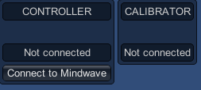
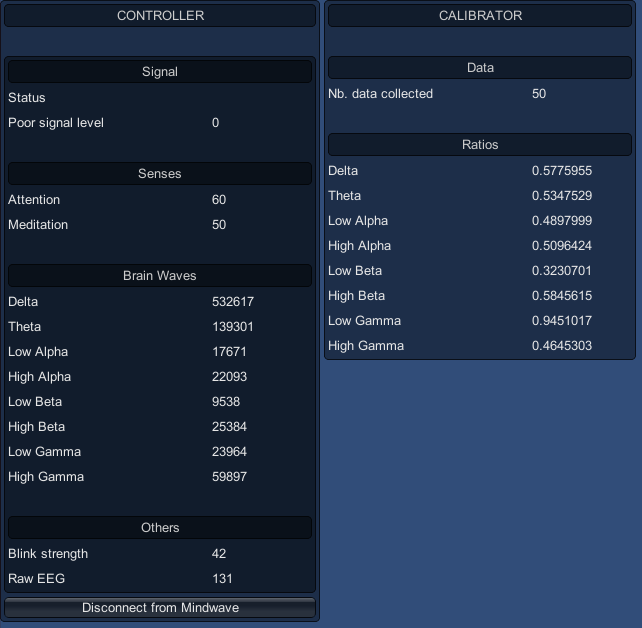

# Mindwave Unity - Getting Started guide

First of all, you must follow the [installation guide](../README.md), in the [README file](../README.md) at the root of the project.

## Getting started

Open the demo scene. Put the Mindwave device on the head of somebody, or yourself. Ensure you have [ThinkGear Connector](http://developer.neurosky.com/docs/doku.php?id=thinkgear_connector_tgc) application running, and the headset turned on... If it does not turn on, you may have missed to put a battery in. No, I'm no judging.

***NOTE**: if you don't see your device in bluetooth managers, you should change the battery and pick a new one... Yeah, I know, that's weird, but it worked everytime for me.*

The demo scene only contains the "MindwaveManager" prefab (at `Plugins/MindwaveUnity/Utilities/MindwaveManager.prefab`). This prefab manages both [`MindwaveController`](./MindwaveController.md) and [`MindwaveCalibrator`](./MindwaveCalibrator.md) components. The prefab also have the [`MindwaveUI`](./MindwaveUI.md) component on it, which is helpful for debugging.

Let's play the demo scene. You should see the following screen :

Click on "Connect to Mindwave" button. It initializes the connection to the Mindwave device. Note that it can fail if the headset is not put correctly (the front metallic part should touch the very center of the user's forehead).

Now, you should see something like this :

... Congratulations, this brain is working!

## Troubleshooting

If the connection can't be established, check the [known issues](./KnownIssues.md).