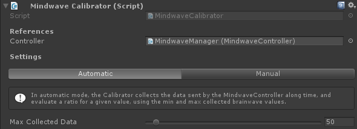
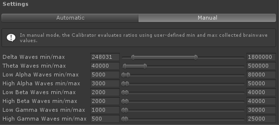

# Mindwave Unity - Calibrator

The brainwaves values (delta, theta, ...) sent by [ThinkGear Connector](http://developer.neurosky.com/docs/doku.php?id=thinkgear_connector_tgc) are kind of... Crazy. You can sometimes have Delta waves at 3000, but next frame you get 1800000 (and this is not a joke). And beyond that, keep in mind that we all don't have the same brain!

The `MindwaveCalibrator` is made to facilitate the work with brainwave values.

## Preview



## Modes

The `MindwaveCalibrator` has two modes : **manual** and **automatic**. You can select the mode by clicking on the appropriate tab.

### Automatic mode

In automatic mode, the component will store each data sent by the headset along time (handled by [`MindwaveController`](./MindwaveController.md) component).

When you call `EvaluateRatio()`, the min and max values for a specific brainwave type will be calculated using the collected data, and the output ratio will depend on these values.

### Manual mode



With Manual mode, you have to define manually the min and max values for each brainwave type.

When you call `EvaluateRatio()`, the min and max values you defined for a specific brainwave will be used for calculating the ratio.

## Usage

### Integration

#### Using the [`MindwaveManager`](./MindwaveManager.md)

You can just drag and drop the "MindwaveManager" prefab (at `Plugins/MindwaveUnity/Utilities/MindwaveManager.prefab`). `MindwaveCalibrator` is already correctly set.

You can also put the [`MindwaveManager`](./MindwaveManager.md) component on a GameObject. An instance of `MindwaveCalibrator` will automatically be added to that GameObject. Follow the steps in *Usage without [`MindwaveManager`](./MindwaveManager.md)* to set it correctly.

#### Integration without [`MindwaveManager`](./MindwaveManager.md)

Put this component on a GameObject. Set a reference to a [`MindwaveController`](./MindwaveController.md) in the scene.

Change the data collecting mode and the settings as you need.

### Settings

* **Controller**: This component needs a reference to a [`MindwaveController`](./MindwaveController.md) in the scene to work.
* **Data Mode**: Click on the "*Automatic*" or "*Manual*" tab to define the data collecting mode. See *Modes* section for more infos about the modes.
* **Max Collected Datas**: *Available only in automatic mode*, defines the number of data instances to store.
* **Brainwave min/max sliders**: *Availables only in manual mode*, define the min and max values for each brainwave type.

## Scripting

```csharp
public float EvaluateRatio(Brainwave _BrainwaveType, int _Value)
```

Evaluates the ratio for the given brainwave value, using the min and max values of the given brainwave type.

* `_BrainwaveType`: The type of the brainwave you want to evaluate. The ratio will be calculated using the min and max values for that brainwave type.
* `_Value`: The value to evaluate for ratio. This value is usually obtained by listening `OnUpdateMindwaveData` event of the [`MindwaveController`](./MindwaveController.md).

---

```csharp
public int DataCount { get; }
```

Gets the number of the collected data instances.

---

```csharp
public MindwaveCalibratorMode Mode { get; set; }
```

Defines the data collecting mode of the `MindwaveCalibrator` component.